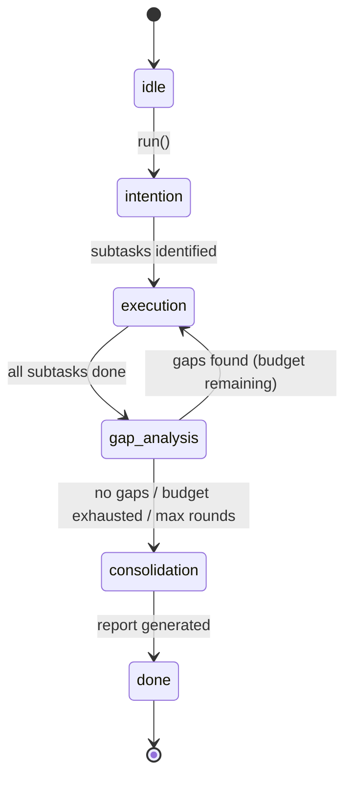

# Audit Brain — Design

> Multi-agent code review pipeline: explore → analyze → review → attack → gap-fill → consolidate.

## Overview

Audit Brain is the **core review engine** of Coacker. It orchestrates a multi-agent pipeline that progressively deepens code understanding through role separation: a fact-finder describes what the code does, a blue-team reviewer flags quality issues, and a red-team attacker hunts for logic vulnerabilities.

```
User Intent + Entry File
        │
        ▼
  ┌─────────────┐
  │  Intention   │  Phase 1: 探索项目，拆分审查子任务
  └──────┬──────┘
         ▼
  ┌─────────────┐
  │  Execution   │  Phase 2: 每个子任务 → impl → review → attack → [propose_issues]
  └──────┬──────┘
         ▼
  ┌─────────────┐
  │ Gap Analysis │  Phase 2.5: 查漏补缺，发现遗漏区域 (可跌代 N 轮)
  └──────┬──────┘
         ▼
  ┌─────────────┐
  │Consolidation │  Phase 3: AI 汇总所有发现，输出最终报告
  └──────┬──────┘
         ▼
     AuditReport
```

## State Machine



### Phase 详解

| Phase | 描述 | AI 角色 |
|-------|------|---------|
| **intention** | 探索项目结构，拆分为具体审查子任务 | Intention Analyzer |
| **execution** | 对每个子任务执行多步审查 pipeline | Implementer → Reviewer → Attacker → [Issue Proposer] |
| **gap_analysis** | 评估已完成审查的覆盖率，补充遗漏 | Gap Analyzer |
| **consolidation** | 汇总所有发现，生成 Executive Summary | Consolidator |

## Pipeline 详细流程

### Phase 1: Intention Analysis

AI 接收:
- `entryFile`: 项目入口文件路径
- `userIntent`: 用户审查意图 (如 "Comprehensive code review")

AI 输出 JSON 数组:
```json
[
  {"id": "access_control", "intention": "Review access control logic in auth modules"},
  {"id": "state_management", "intention": "Analyze state transitions and persistence"}
]
```

**解析容错**: `extractJSON` → regex 提取 → fallback 单任务。数量上限由 `maxSubTasks` 控制。

### Phase 2: Execution (Multi-Step Sub-Task)

每个子任务在**同一个对话**中顺序执行 4 步 (最后一步可选):

```
Step 1: impl            → Implementation Analyzer (纯事实描述)
Step 2: review           → Ground Reviewer / 蓝队 (代码质量审查)
Step 3: attack           → Intention Attacker / 红队 (逻辑漏洞攻击)
Step 4: propose_issues   → Issue Proposer (仅在配置 origin 时启用)
```

**关键设计**: 4 步在同一对话中执行，后续步骤可利用前面的上下文。每步使用不同的 System Prompt 切换角色视角。

**上下文传递**: 每个子任务会收到前 5 个已完成任务的摘要 (`Prior Knowledge`)，避免重复分析。

### Phase 2.5: Gap Analysis (可迭代)

```
已有 reports  →  Gap Analyzer  →  发现 N 个遗漏  →  回到 Phase 2 执行新子任务
                                  └─ 无遗漏 → 进入 Phase 3
```

迭代控制:
- `maxGapRounds`: 最大迭代轮数 (0 = 禁用)
- 剩余 budget = `maxSubTasks` - 已完成报告数
- 当 `completeness_score >= 8` 且无 critical gaps 时，Gap Analyzer 返回空数组

### Phase 3: Consolidation

汇总所有 `TaskReport`，输出结构化 Markdown 报告:
- Executive Summary
- Top Issues (ranked by severity)
- Risk Assessment
- Recommendations

## 角色 Prompts (7 个)

| # | 角色 | 职责 | 输出格式 |
|---|------|------|----------|
| 1 | **Intention Analyzer** | 探索项目 + 拆分子任务 | JSON 数组 |
| 2 | **Implementation Analyzer** | 纯事实描述代码实现路径 | Markdown |
| 3 | **Ground Reviewer** (蓝队) | 代码质量: 资源泄漏、异常处理、线程安全 | Markdown (Critical/Warning/Info) |
| 4 | **Intention Attacker** (红队) | 逻辑攻击: 状态不一致、授权缺失、TOCTOU | Markdown (Critical/High/Medium) |
| 5 | **Issue Proposer** | Critical/High 发现 → `gh issue create` | Terminal 命令 |
| 6 | **Gap Analyzer** | 评估覆盖率，发现遗漏 | JSON `{completeness_score, gaps}` |
| 7 | **Consolidator** | 汇总所有发现，综合报告 | Markdown |

> [!IMPORTANT]
> Implementation Analyzer **严格禁止** 做任何价值判断 (好/坏/安全/不安全)。它只描述事实。
> Issue Proposer **只使用** `gh issue create`，不走 MCP/API。

## 数据类型

### SubTask — 子任务 (Intention 解析结果)

```typescript
interface SubTask {
  id: string;                      // 唯一标识 (snake_case)
  intention: string;               // 审查意图描述
  status: "pending" | "in_progress" | "done";
  conversationId?: string;         // 执行对话 ID
  checkpoint?: ChatCheckpoint;     // 断点续传位置
  completedSteps?: string[];       // 已完成 step ID 列表
  currentStep?: string;            // 当前执行步骤
  stepProgress?: string;           // "1/3" 进度
}
```

### TaskReport — 单个子任务的审查报告

```typescript
interface TaskReport {
  taskId: string;
  intention: string;
  implementation: string;    // Step 1 输出
  codeReview: string;        // Step 2 输出
  attackReview: string;      // Step 3 输出
  issueProposals: string;    // Step 4 输出 (可空)
}
```

### AuditReport — 最终输出

```typescript
interface AuditReport {
  tasks: TaskReport[];
  summary: string;
  executiveSummary: string;
  toMarkdown(): string;
}
```

## 断点续传 (Resume)

Audit Brain 支持在任意阶段中断后恢复执行:

### 持久化文件

```
output/
├── state.json           # AuditBrainState: phase, gapRound, subtasks, reportIds
├── intention.json       # SubTask[] (含 checkpoint 信息)
├── history.json         # 完整 TaskResult 历史
├── reports/
│   ├── access_control.json    # 每个子任务的 TaskReport
│   └── state_management.json
├── conversations/
│   └── <convId>_<taskId>.json  # ask/answer 对话记录
└── audit-report.md      # 最终 Markdown 报告
```

### ChatCheckpoint — 精确断点

```typescript
interface ChatCheckpoint {
  chat_status: "sent" | "responded";  // sent = 等回复, responded = 待下一步
  chat_type: string;                  // 当前步骤类型 (impl/review/attack)
  chat_input: string;                 // 当前步骤发送的 prompt
  conversation_title: string | null;  // 用于切回对话
}
```

### Resume 逻辑

```
loadState() → 检查 phase
  ├─ idle / done → 从头开始
  └─ 其他 → resume()
       ├─ 恢复 subtasks, reports, gapRound
       ├─ 处理 in_progress 的 subtask
       │    ├─ checkpoint.chat_status = "sent"
       │    │    → switchToConversation() → waitForResponse() → continueTask()
       │    └─ checkpoint.chat_status = "responded"
       │         → switchToConversation() → continueTask()
       ├─ 执行剩余 pending subtasks
       └─ finalize() (gap analysis + consolidation)
```

## 模块结构

```
packages/brain/src/audit/
├── audit-brain.ts      # 状态机: run(), resume(), finalize(), executeSubTask()
├── types.ts            # SubTask, TaskReport, AuditReport, AuditPhase, AuditBrainState
├── prompts.ts          # 7 个角色的 System Prompt
├── task-builder.ts     # 构造 Task: buildIntentionTask, buildSubTask, buildGapTask, buildConsolidationTask
├── result-parser.ts    # 解析 AI 回复: parseIntentionTasks, parseGapResult, extractReport
├── persister.ts        # 持久化 + 加载: persistState, loadState, loadReports, loadIntention
├── report-builder.ts   # buildReport() → AuditReport (含 toMarkdown())
└── index.ts            # Barrel exports
```

### 职责分离

| 模块 | 职责 | 依赖 |
|------|------|------|
| `audit-brain.ts` | 决策 + 状态驱动 | 所有子模块 |
| `task-builder.ts` | 构造 Task 数据结构 | `types.ts` |
| `result-parser.ts` | 解析 AI 文本输出 | `@coacker/player` (extractJSON) |
| `persister.ts` | 文件系统读写 | `node:fs` |
| `report-builder.ts` | 报告格式化 | `types.ts` |
| `prompts.ts` | System Prompt 文本 | 无 |

## 配置

```toml
[brain.audit]
maxGapRounds = 1    # Gap Analysis 最大迭代轮数 (0 = 禁用 gap analysis)
maxSubTasks = 2     # 子任务总数上限 (含 gap 补充的任务)
```

## 与上层的关系

```
                      ┌──────────────────────────┐
                      │     config.toml          │
                      │  [brain.audit] 配置      │
                      └─────────┬────────────────┘
                                │
                      ┌─────────▼────────────────┐
                      │     AuditBrain            │ ← Brain 层: 决策
                      │  run(player) → AuditReport│
                      └─────────┬────────────────┘
                                │ 委托 Task
                      ┌─────────▼────────────────┐
                      │     Player                │ ← 执行层: 发送 prompt, 收集回复
                      │  executeTask(task)         │
                      └─────────┬────────────────┘
                                │ CDP / HTTP
                      ┌─────────▼────────────────┐
                      │     Backend (AG)          │ ← 连接层: IDE 交互
                      └──────────────────────────┘
```

复用 `@coacker/shared` 的 `Task` / `TaskStep` 抽象。
复用 `@coacker/player` 执行对话 + `extractJSON` 解析。
