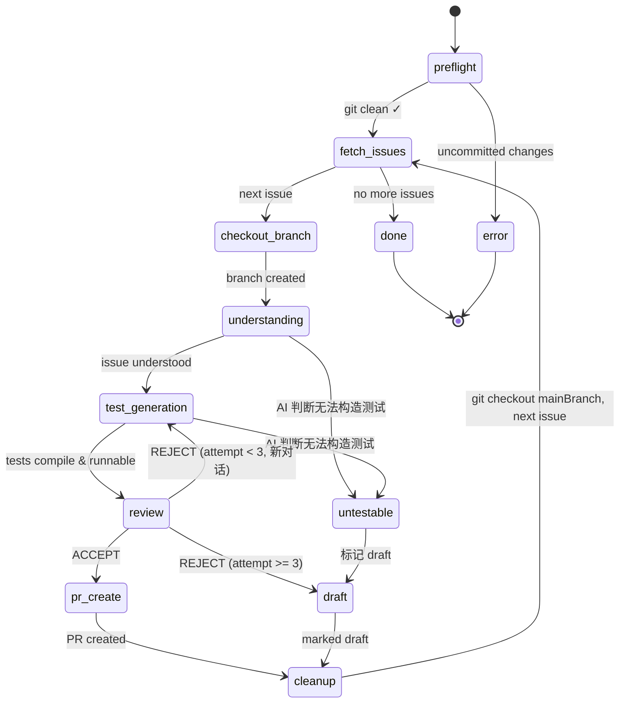

# Issue Validator Brain — Design

> Validate audit-proposed issues by generating test code, reviewing quality, and constructing test PRs.

## Overview

Issue Validator Brain sits **downstream** of Audit Brain. It takes GitHub issues and attempts to
**prove or disprove** each issue through automated test construction and verification.

```
Audit Brain (提出 issue)  →  Issue Validator Brain (验证 issue → test PR)  →  Fix Brain (修复 issue)
                                     ↑ 本文档                                      ↑ 未来
```

**输入源**: GitHub issues (通过 label 过滤, 如 `coacker-audit`)
**串行处理**: 一次验证一个 issue, 不并发

## State Machine



## Phase 详解

| Phase | 对话 | 角色视角 | 描述 |
|-------|------|---------|------|
| **preflight** | — | — | 检查 `git status` 确保无未提交变更 |
| **fetch_issues** | — | — | 从 GitHub 拉取待验证 issues |
| **checkout_branch** | — | — | `git checkout -b issue_validator/issue{N}` (从 `mainBranch` 创建) |
| **understanding** | Conv A | 分析者 | 阅读 issue + 源码, 理解问题本质 |
| **test_generation** | Conv A | 作者 🖊️ | 编写测试代码, 确保可编译可执行 |
| **review** | Conv B (新对话) | 审查者 👁️ | 独立审查测试质量, ACCEPT/REJECT |
| **untestable** | — | — | AI 拒绝: 无法构造测试 → draft |
| **pr_create** | — | — | 创建 test PR |
| **draft** | — | — | 标记 PR 为 draft, 人类接手 |
| **cleanup** | — | — | 确保工作区干净, 切回 `mainBranch` |

## Pipeline 详细流程

### Phase 0a: Preflight — Git 状态检查

在开始任何操作前, 检查当前工作区:

```bash
git status --porcelain
```

- 如果有未提交的变更 → **终止**, 报错提示用户先处理
- 如果工作区干净 → 继续

> [!CAUTION]
> 这是硬性前置条件。未提交的变更会导致后续 branch 操作污染或丢失代码。

### Phase 0b: Fetch Issues

从 GitHub 拉取标记了指定 label 的 issues, 构建待验证队列。

### Phase 0c: Checkout Branch — 创建工作分支

为每个 issue 创建独立分支:

```bash
git checkout <mainBranch>          # 先切回主分支
git checkout -b issue_validator/issue<N>   # 从主分支创建新分支
```

分支命名: `issue_validator/issue{issueNumber}`, 例如 `issue_validator/issue33`。
`mainBranch` 通过配置指定 (默认 `main`)。

### Phase 1: Issue Understanding (Conv A) — 分析者视角

AI 接收:
- Issue title + body
- 相关源码文件

AI 输出:
- 结构化理解: 问题是什么、影响范围、预期行为 vs 实际行为
- 识别需要测试的核心逻辑路径
- **可测试性判断**: 如果 AI 认为该 issue 无法通过自动化测试验证 → `untestable`

**关键**: 这一步不写代码, 只建立理解。AI 有权拒绝无法构造测试的 issue。

### Phase 2: Test Code Generation (Conv A 续) — 作者视角 🖊️

同一对话继续 (上下文连贯):
- AI **自行检测项目的测试框架** (vitest / jest / mocha / 等)
- AI 以代码作者视角编写测试代码
- AI 运行测试, 确保编译通过、可执行
- 如果 AI 发现实际上无法构造有意义的测试 → `untestable`

**"通过"标准**: 测试代码可编译可执行。
测试逻辑是否正确由下一步 reviewer 判断。

> [!IMPORTANT]
> Phase 2 的 AI 是**逻辑生成者** — 它理解了 issue、读了源码、写了测试,
> 这个过程中形成了实现偏见 (implementation bias)。
> 因此必须由新对话的独立 reviewer 来判断测试是否真的验证了 issue。

### Phase 3: Review (Conv B, 新对话) — 审查者视角 👁️

**为什么新对话**: 视角隔离。Phase 2 是 "作者", Phase 3 是 "第三方 reviewer"。
Reviewer 没有作者的上下文, 只基于客观材料判断。

Reviewer 接收 (干净输入, 无作者思路):
- 原始 issue 内容
- 生成的测试代码
- 测试执行结果

Reviewer 输出验证报告:
```json
{
  "verdict": "ACCEPT | REJECT",
  "logic_review": "测试逻辑是否正确覆盖了 issue 描述的问题",
  "audit_review": "测试代码质量 (assertion 合理性、边界条件)",
  "verification": "实际运行结果分析",
  "issues": ["具体问题1", "具体问题2"],
  "summary": "最终判断理由"
}
```

- **ACCEPT** → Phase 4: PR Create
- **REJECT** → 回到 Phase 2 (新对话, 携带 reviewer 报告), 最多重试 3 次
- 3 次仍 REJECT → 标记 draft

### Phase 4: PR Create

- 在当前 `issue_validator/issue{N}` 分支上 commit 测试代码
- `gh pr create` 提交 test PR
- 标记 issue 为 validated

### Untestable → Draft

AI 在 Phase 1 或 Phase 2 主动判断无法构造测试的场景:
- Issue 描述过于模糊, 无法明确测试目标
- 涉及外部服务/环境依赖, 无法在单测中复现
- 需要 UI 交互或手动操作才能验证
- 问题是设计层面的, 无法用测试代码表达

此时直接标记 PR 为 draft, 人类接手。

### Phase 5: Cleanup — 切回主分支

PR 创建或标记 draft 后, 清理工作区:

```bash
# 1. 检查是否有未提交变更
git status --porcelain

# 2. 如果有 → 让 AI 整理 (commit 或 stash)
# 3. 确认干净后 → 切回主分支
git checkout <mainBranch>
```

> [!IMPORTANT]
> 必须确保工作区干净后再切回 `mainBranch`。
> 如果 AI 遗留了未提交文件, 在 cleanup 阶段处理 (commit 到当前分支或 stash),
> 然后才能安全切换到主分支, 为下一个 issue 创建新分支。

## 角色 Prompts

| 角色 | 职责 |
|------|------|
| **Issue Analyst** | 理解 issue, 判断可测试性 |
| **Test Generator** | 检测测试框架, 编写测试代码 |
| **Test Reviewer** | 独立审查测试质量, ACCEPT/REJECT |

> [!NOTE]
> 没有 Test Fixer 角色。Fix 是下一个 brain (Fix Brain) 的职责。
> Validator Brain 只负责**验证** issue 是否真实可复现。

## 配置

```toml
[project]
mainBranch = "main"           # 主分支名 (默认 "main", 可设为 "master" 等)

[brain.validate]
maxReviewAttempts = 3         # review-retry 循环上限
excludeLabels = ["wontfix", "duplicate", "invalid"]  # 黑名单: 排除带这些 label 的 issue
draftOnFailure = true         # 失败后标记 draft
```

## 项目结构

```
packages/brain/src/
├── audit/           # Audit Brain (已有)
├── validate/        # Issue Validator Brain (新增)
│   ├── validate-brain.ts
│   ├── types.ts
│   ├── prompts.ts
│   ├── task-builder.ts
│   ├── result-parser.ts
│   ├── persister.ts
│   └── index.ts
└── index.ts
```

## Brain Pipeline 全景

```
Audit Brain → Issue Validator Brain → Fix Brain (未来)
  发现问题        验证问题 + test PR      修复问题 + fix PR
```
